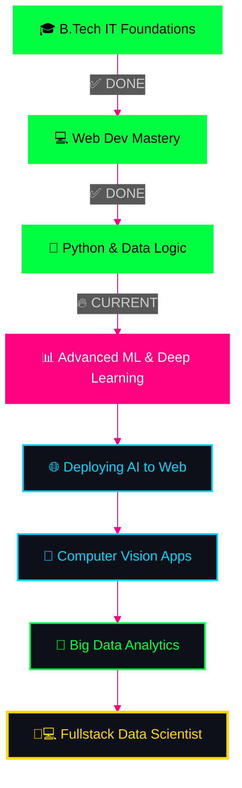

<!-- Epic typing animation -->
<div align="center" >
  
</div>


<br>

<!-- Matrix Hacker GIF -->


</div>

---

<!-- Glowing status badges -->
<div align="center">


</div>

---


## 🎯 `[CLASSIFIED] OPERATIVE PROFILE`

<div align="center">

<table>
<tr>
<td width="50%" valign="top">

```yaml
╔══════════════════════════════════════╗
║  AGENT ID: satyajitpratihar07        ║
║  NAME: Satyajit Pratihar             ║
║  LOCATION: Kolkata, West Bengal      ║
║  INSTITUTION: GNIT                   ║
║  CLEARANCE: Level 3                  ║
║  DIVISION: Data & Web Operations     ║
║  STATUS: Active Development          ║
╚══════════════════════════════════════╝

🎓 EDUCATION:
   └─ B.Tech (IT) 
   └─ Guru Nanak Institute of Technology
   └─ Hobby: Electronics 🔋
   
🎯 MISSION OBJECTIVE:
   └─ Fullstack Developer
   └─ Data Scientist
   └─ AI/ML Integration
   
⚡ CURRENT OPERATIONS:
   └─ Building Scalable Web Apps
   └─ Exploring Data Patterns
   └─ Open Source Contributor
```

</td>
<td width="50%" valign="top">


<br>

### `💭 LIFE PHILOSOPHY`

```python
class SatyajitPratihar:
    def __init__(self):
        self.name = "Satyajit Pratihar"
        self.role = "Fullstack Developer"
        self.location = "Kolkata, India"
    
    def say_hi(self):
        print("Transforming ideas into code,")
        print("One insight at a time!")

me = SatyajitPratihar()
me.say_hi()
```

### `📜 WISDOM`
*"Information is the oil of the 21st century, and analytics is the combustion engine."*
**— Peter Sondergaard**

</td>
</tr>
</table>

</div>

---


## 🔥 `[ARSENAL] WEAPONS & TECH STACK`

<div align="center">

### `⚔️ PRIMARY WEAPONS`


### `📊 DATA SCIENCE & ML`


### `🛠️ FULLSTACK DEVELOPMENT`


</div>

<br>

<div align="center">
<table>
<tr>
<td width="33%" align="center">

### `💻 LANGUAGES`
```yaml
Primary:
  - Python ████████████ 90%
  - JavaScript ██████████░ 85%
  - C ████████░░░░ 70%
  - Java ████████░░░░ 70%

Database:
  - MySQL ██████████░░ 80%
```

</td>
<td width="33%" align="center">

### `🌐 WEB TECH`
```yaml
Frontend:
  - HTML5 ████████████ 95%
  - CSS3 ████████████ 95%
  - JavaScript ██████████ 85%
  - React ████████░░░░ 75%

Tools:
  - Vercel ██████████░░ 85%
  - GitHub ████████████ 90%
```

</td>
<td width="33%" align="center">

### `🤖 AI & ML`
```yaml
Intelligence:
  - Computer Vision ██████ 65%
  - TensorFlow ██████░░░ 60%

Libraries:
  - OpenCV ████████░░░ 70%
  - SciKit-Learn █████░░ 55%
```

</td>
</tr>
</table>
</div>

---


## 📊 `[INTEL] GITHUB OPERATIONS`

<div align="center">


</div>

---


## 🎯 `[PROJECTS] TACTICAL OPERATIONS`

<div align="center">


<table>
<tr>
<td width="50%" valign="top">

### 🔐 **EDUAUTH - AUTH PLATFORM**

```bash
┏━━━━━━━━━━━━━━━━━━━━━━━━━━━━━━━━┓
┃ PROJECT: EduAuth               ┃
┣━━━━━━━━━━━━━━━━━━━━━━━━━━━━━━━━┫
┃ [●] HTML5 + CSS3 + JavaScript  ┃
┃ [●] Educational Authentication ┃
┃ [●] Secure User Management     ┃
┃ [●] Modern Web UI              ┃
┣━━━━━━━━━━━━━━━━━━━━━━━━━━━━━━━━┫
┃ STATUS: 🟢 LIVE                ┃
┗━━━━━━━━━━━━━━━━━━━━━━━━━━━━━━━━┛
```

[](https://eduauth-v1.vercel.app/)
[](https://github.com/satyajitpratihar07/EduAuth)

</td>
<td width="50%" valign="top">

### 💰 **SPENDLY - EXPENSE TRACKER**

```bash
┏━━━━━━━━━━━━━━━━━━━━━━━━━━━━━━━━┓
┃ PROJECT: Spendly               ┃
┣━━━━━━━━━━━━━━━━━━━━━━━━━━━━━━━━┫
┃ [●] HTML5 + CSS3 + JavaScript  ┃
┃ [●] Daily Expense Management   ┃
┃ [●] Financial Habits Builder   ┃
┃ [●] PWA / Responsive Web       ┃
┣━━━━━━━━━━━━━━━━━━━━━━━━━━━━━━━━┫
┃ STATUS: 🟢 LIVE                ┃
┗━━━━━━━━━━━━━━━━━━━━━━━━━━━━━━━━┛
```

[](https://spendly-org.vercel.app/)
[](https://github.com/satyajitpratihar07/Spendly)

</td>
</tr>
<tr>
<td width="50%" valign="top">

### 🌌 **LINKORBI - LINK SAVER**

```bash
┏━━━━━━━━━━━━━━━━━━━━━━━━━━━━━━━━┓
┃ PROJECT: LinkOrbi              ┃
┣━━━━━━━━━━━━━━━━━━━━━━━━━━━━━━━━┫
┃ [●] HTML5 + CSS3 + JavaScript  ┃
┃ [●] Link Persistence           ┃
┃ [●] Creative UX/UI             ┃
┃ [●] URL Organization           ┃
┣━━━━━━━━━━━━━━━━━━━━━━━━━━━━━━━━┫
┃ STATUS: 🟢 LIVE                ┃
┗━━━━━━━━━━━━━━━━━━━━━━━━━━━━━━━━┛
```

[](https://link-orbi.vercel.app/)
[](https://github.com/satyajitpratihar07/linkorbi)

</td>
<td width="50%" valign="top">

### 🗑️ **SMART WASTE CLASSIFIER**

```bash
┏━━━━━━━━━━━━━━━━━━━━━━━━━━━━━━━━┓
┃ PROJECT: Waste Classification  ┃
┣━━━━━━━━━━━━━━━━━━━━━━━━━━━━━━━━┫
┃ [●] Python + TensorFlow        ┃
┃ [●] Deep Learning (CNN)        ┃
┃ [●] Image Recognition          ┃
┃ [●] Autonomous Categorization  ┃
┣━━━━━━━━━━━━━━━━━━━━━━━━━━━━━━━━┫
┃ STATUS: 🟢 COMPLETE            ┃
┗━━━━━━━━━━━━━━━━━━━━━━━━━━━━━━━━┛
```

[](https://github.com/satyajitpratihar07/Smart-Waste-Classifier-Final)

</td>
</tr>
</table>

<details>
<summary><b>📂 VIEW MORE OPERATIONS (REPOSITORIES)</b></summary>
<br>

- [**ResizeOrbi**](https://satyajitpratihar07.github.io/ResizeOrbi/) - Document Optimization Tool
- [**Global-Weather**](https://satyajitpratihar07.github.io/Global-Weather/) - Real-time Weather App
- [**Images-Generator**](https://imagesgenerator-lovat.vercel.app/) - AI Image Gallery (Vercel)
- [**Smart-Attendance**](https://github.com/satyajitpratihar07/Smart-Attendance-with-Facial-Recognition) - Facial Recognition System
- [**LinkOrbi-LinkSaver**](https://link-orbi-link-saver.vercel.app/) - Creative Link Manager

</details>


</div>

---


## 🎓 `[ROADMAP] MASTER PLAN - FULLSTACK & DATA SCIENCE JOURNEY`

<div align="center">


</div>



---


## 🌐 `[NETWORK] ESTABLISH CONNECTION`

<div align="center">


### `🔗 SECURE COMMUNICATION CHANNELS`

<table>
<tr>
<td align="center" width="25%">

[](https://github.com/satyajitpratihar07)
<br>
**Source Code**

</td>
<td align="center" width="25%">

[](https://www.linkedin.com/in/satyajit-pratihar-911182341)
<br>
**Professional**

</td>
<td align="center" width="25%">

[](mailto:satyajitpratihar96@gmail.com)
<br>
**Direct Mail**

</td>
</tr>
</table>

### `📍 LOCATION & INFO`


</div>

---


## 💾 `[DATABASE] CLASSIFIED INTEL`

<details>
<summary><b>🔐 OPERATIVE DOSSIER</b> <i>(Click to decrypt)</i></summary>

<br>

```yaml
╔═══════════════════════════════════════════════════════════════╗
║                    CLASSIFIED DOSSIER                         ║
║                 [SECURITY CLEARANCE: LEVEL 3]                 ║
╠═══════════════════════════════════════════════════════════════╣
║                                                               ║
║  PERSONAL IDENTIFICATION:                                     ║
║    Full Name: Satyajit Pratihar                               ║
║    Call Sign: satyajitpratihar07                              ║
║    Institution: Guru Nanak Institute of Technology (GNIT)     ║
║    Email: satyajitpratihar96@gmail.com                        ║
║    Hobby: Electronics & Circuit Design                        ║
║                                                               ║
║  MISSION OBJECTIVES:                                          ║
║    Primary Target: Fullstack Development                      ║
║    Secondary Target: Data Science & Analytics                 ║
║    Tertiary Target: Edge AI & IoT (Electronics)               ║
║                                                               ║
║  OPERATIONAL ACHIEVEMENTS:                                    ║
║    ├─ EduAuth (Authentication Platform)                       ║
║    ├─ Spendly (Expense Management Suite)                      ║
║    ├─ LinkOrbi (Link Management System)                       ║
║    ├─ Smart Waste Classifier (Deep Learning CNN)              ║
║    └─ Smart Attendance (Computer Vision)                      ║
║                                                               ║
╚═══════════════════════════════════════════════════════════════╝
```

</details>

---


<div align="center">
<sub><i>Crafted with ❤️ for @satyajitpratihar07 | Last Updated: March 2026</i></sub>
</div>
