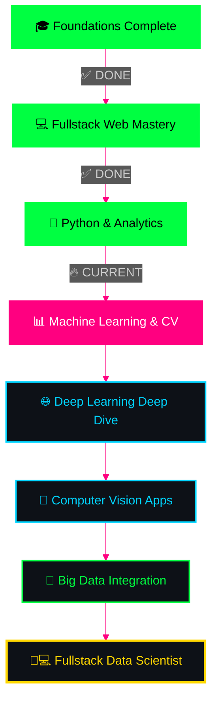

<!-- Epic typing animation -->
<div align="center" >
  
</div>


<br>

<!-- Matrix Hacker GIF -->


</div>

---
## Hello, Nice to Meet You !! [🔝](#--gifs-for-readme--)

```
████████████████████████████████████████████████████████████  ██╗  ██╗███████╗██╗     ██╗      ██████╗
████████████████████████████████████████████████████████████  ██║  ██║██╔════╝██║     ██║     ██╔═══██╗
███████████████████████████████████`.        ╙██████████████  ███████║█████╗  ██║     ██║     ██║   ██║
████████████████████████████████▀  ¿▓▓▓▓▓▓▓▓▄/ "████████████  ██╔══██║██╔══╝  ██║     ██║     ██║   ██║
██████████████████████████████▀.  ▓▓▓▓▓▓▓▓▓▓▓▓   ▐██████████  ██║  ██║███████╗███████╗███████╗╚██████╔╝▄█╗
██████████████████████████████ `  ▓▓▓▓▓▓▓▓▓▓▓▓  ` ██████████  ╚═╝  ╚═╝╚══════╝╚══════╝╚══════╝ ╚═════╝ ╚═╝
██████████████████████████████ `  ▓▓▓▓▓▓▓▓▓▓▓▓   ▄██████████
▀██████████████████████████████▌  ▀▀▓▓▓▓▓▓▓▌╓╖. ████████████  ███╗   ██╗██╗ ██████╗███████╗  ████████╗ ██████╗
█▄▀██████████████████████████████▄ ╩╦╙▀▀▀▀▀ ╣`,█████████████  ████╗  ██║██║██╔════╝██╔════╝  ╚══██╔══╝██╔═══██╗
▄▀█▄╙█████████████████████▀▀▀▀█████▄▄ .... ,▄███████▀███████  ██╔██╗ ██║██║██║     █████╗       ██║   ██║   ██║
██▄▀█▄╙█████████████████▀  ╪╢%╦══~╓,└ ╚▒▒▒ ╙▀|,╓╓═╤H   ▀████  ██║╚██╗██║██║██║     ██╔══╝       ██║   ██║   ██║
█▀▀▀-▀█▌▄▀█████████████   ║▒▒▒▒▒▒▒▒▒▒╢╦ ╘ -╣▒▒▒▒▒▒▒▒▒╢╕   ▀█  ██║ ╚████║██║╚██████╗███████╗     ██║   ╚██████╔╝
██▄▀██└║▄▄▄████████████▄          ═╕╕╕╕╕═╕═══════       ▄▄▄▄  ╚═╝  ╚═══╝╚═╝ ╚═════╝╚══════╝     ╚═╝    ╚═════╝
████▄▀█▌║███  ████████▌         ╕   ╩▒▒▒▒▒▒▒▒▒Ñ          ███
██████▌Ö▓▌   ▀██████████`╔▒▒╣ █ ▒▒m   ╚▒╢▒▒▒╩ -╣▒ ▌ ▒▒▒ ████  ███╗   ███╗███████╗███████╗████████╗  ██╗   ██╗ ██████╗ ██╗   ██╗
████ -"" ∞╙,▀.╙▀███████╜ ▒▒▒ ▄█ Ñ   -   S.  ═▒▒▒▒ █ ║▒▒╕└███  ████╗ ████║██╔════╝██╔════╝╚══██╔══╝  ╚██╗ ██╔╝██╔═══██╗██║   ██║
████████▄ -«   ∞▄.▀",╓═     ╒██   ═╣▒▒ `Ñ╛        █▌ ▒▒▒ ███  ██╔████╔██║█████╗  █████╗     ██║      ╚████╔╝ ██║   ██║██║   ██║
█████████▌ º     ╤╣▒╣╩^",▄▄███▀  ▒▒╣"     ''''''' ▀▀     `██  ██║╚██╔╝██║██╔══╝  ██╔══╝     ██║       ╚██╔╝  ██║   ██║██║   ██║
█████████  ▌       ▄▄████████─         ---------    L'▒▒▒ ██  ██║ ╚═╝ ██║███████╗███████╗   ██║        ██║   ╚██████╔╝╚██████╔╝
▀▀▀▀▀▀▀▀▀▀▀▀▀-     ▀▀▀▀▀▀▀▀▀▀       '╧╧╧╧╧╧╧╧╧`     ╚ ╧╧╧- ▀  ╚═╝     ╚═╝╚══════╝╚══════╝   ╚═╝        ╚═╝    ╚═════╝  ╚═════╝
```
<!-- Glowing status badges -->
<div align="center">


</div>

---


## 🎯 `[CLASSIFIED] OPERATIVE PROFILE`

<div align="center">

<table>
<tr>
<td width="50%" valign="top">

```yaml
╔══════════════════════════════════════╗
║  AGENT ID: satyajitpratihar07        ║
║  NAME: Satyajit Pratihar             ║
║  LOCATION: Kolkata, West Bengal      ║
║  INSTITUTION: GNIT                   ║
║  CLEARANCE: Level 3                  ║
║  DIVISION: Data & Web Operations     ║
║  STATUS: Active Development          ║
╚══════════════════════════════════════╝

🎓 EDUCATION:
   └─ B.Tech (IT) 
   └─ Guru Nanak Institute of Technology
   
🎯 MISSION OBJECTIVE:
   └─ Fullstack Developer
   └─ Data Science Engineer
   └─ Data Engineer
   └─ Backend Developer


   
⚡ CURRENT OPERATIONS:
   └─ Building Secure Web Apps
   └─ IoT & Electronics Research
   └─ Real World Problem Solved
```

</td>
<td width="50%" valign="top">


<br>

### `💭 LIFE PHILOSOPHY`

```python
class DigitalArchitect:
    def __init__(self):
        self.name = "Satyajit Pratihar"
        self.role = "Fullstack Developer"
        self.focus = "Data intelligence"
    
    def say_hi(self):
        print("Transforming logic into impact,")
        print("One deep-dive at a time!")

me = DigitalArchitect()
me.say_hi()
```

### `📜 WISDOM`
*"Information is the oil of the 21st century, and analytics is the combustion engine."*
**— Peter Sondergaard**

</td>
</tr>
</table>

</div>

---


## 🏆 `[ELITE STATUS] LEADERSHIP & ACHIEVEMENTS`

<div align="center">

<table>
<tr>
<td width="50%" align="center">


### `🎓 B-TECH IT ENGINEER`

```diff
@@ GNIT KOLKATA - ACADEMIC LEADER @@
+ CGPA: Competitive (Top Performer)
+ Status: ACTIVE

[✓] Mastering IT foundations
[✓] Developing high-security auth systems
[✓] Implementing ML for sustainability
[✓] Leading collaborative tech teams
[✓] Exploring Edge AI & IoT
```

</td>
<td width="50%" align="center">


### `💼 FULLSTACK INNOVATOR`

```diff
@@ WEB ARCHITECTURE OPERATIONS @@
+ Focus: Security & Scalability
+ Platforms: Vercel, Supabase, Git
+ Status: IN PROGRESS

[✓] EduAuth: Advanced Auth System
[✓] Spendly: Financial Analytics
[✓] LinkOrbi: Workspace Optimization
[✓] Real-world problem solving
```

</td>
</tr>
</table>

<br>

### `🎖️ OPEN SOURCE & CERTIFICATIONS`

<table>
<tr>
<td align="center">

[](https://holopin.io/@satyajitpratihar07)

**🔥 CONTRIBUTION PULSE**
```
[████████████] ACTIVE
Status: SUPER CONTRIBUTOR
```

</td>
<td align="center">


**☁️ DATA & CLOUD AGENT**
```
Data Science Fundamentals
Status: CERTIFIED ✓
```

</td>
</tr>
</table>

### `🎓 ADDITIONAL CERTIFICATIONS`


</div>

---


## 🔥 `[ARSENAL] WEAPONS & TECH STACK`

<div align="center">

### `⚔️ PRIMARY WEAPONS`


### `📊 DATA SCIENCE & MACHINE LEARNING`


### `🛠️ FULLSTACK & ELECTRONICS`


</div>

<br>

<div align="center">
<table>
<tr>
<td width="33%" align="center">

### `💻 LANGUAGES`
```yaml
Primary:
  - Python ████████████ 95%
  - JavaScript █████████░ 90%
  - C ████████░░░░ 70%
  - Java ████████░░░░ 70%

Database:
  - MySQL ██████████░░ 80%
```

</td>
<td width="33%" align="center">

### `🌐 WEB TECH`
```yaml
Frontend:
  - HTML5 ████████████ 98%
  - CSS3 ███████████░ 92%
  - React ████████░░░ 75%
  - GSAP ████████░░░░ 70%

Backend:
  - Node.js ████████░░░ 75%
  - Express ███████░░░░ 70%
```

</td>
<td width="33%" align="center">

### `🤖 AI & HARDWARE`
```yaml
Machine Learning:
  - TensorFlow ████████ 80%
  - Machine Learning ██░ 85%

Hardware:
  - Arduino █████████░ 88%
  - IoT Systems ██████ 65%
```

</td>
</tr>
</table>
</div>

---


## 📊 `[INTEL] GITHUB OPERATIONS`

<div align="center">


<!-- Profile Summary -->


<table>
<tr>
<td width="50%">

</td>
<td width="50%">

</td>
</tr>
<tr>
<td width="50%">

</td>
<td width="50%">

</td>
</tr>
</table>

### `🏆 TROPHY COLLECTION`


### `🐍 CONTRIBUTION SNAKE`

<picture>
  <source media="(prefers-color-scheme: dark)" srcset="https://raw.githubusercontent.com/satyajitpratihar07/satyajitpratihar07/output/github-contribution-grid-snake-dark.svg">
  <source media="(prefers-color-scheme: light)" srcset="https://raw.githubusercontent.com/satyajitpratihar07/satyajitpratihar07/output/github-contribution-grid-snake.svg">
  
</picture>

</div>

---


## 🎯 `[PROJECTS] TACTICAL OPERATIONS`

<div align="center">


<table>
<tr>
<td width="50%" valign="top">

### 🖥️ **EDUAUTH - SECURE AUTH PLATFORM**

```bash
┏━━━━━━━━━━━━━━━━━━━━━━━━━━━━━━━━┓
┃ PROJECT: EduAuth               ┃
┣━━━━━━━━━━━━━━━━━━━━━━━━━━━━━━━━┫
┃ [●] HTML5 + CSS3 + JavaScript  ┃
┃ [●] Advanced Authentication    ┃
┃ [●] Multi-role Access Control  ┃
┃ [●] Modern Secure UI/UX        ┃
┃ [●] Fully Responsive Design    ┃
┣━━━━━━━━━━━━━━━━━━━━━━━━━━━━━━━━┫
┃ STATUS: 🟢 LIVE                ┃
┗━━━━━━━━━━━━━━━━━━━━━━━━━━━━━━━━┛
```

[](https://eduauth-v1.vercel.app/)
[](https://github.com/satyajitpratihar07/EduAuth)

</td>
<td width="50%" valign="top">

### 🛒 **SPENDLY - EXPENSE TRACKER**

```bash
┏━━━━━━━━━━━━━━━━━━━━━━━━━━━━━━━━┓
┃ PROJECT: Spendly OS            ┃
┣━━━━━━━━━━━━━━━━━━━━━━━━━━━━━━━━┫
┃ [●] HTML5 + CSS3 + JavaScript  ┃
┃ [●] Daily Expense Management   ┃
┃ [●] Financial Behavioral Logs  ┃
┃ [●] Interactive Dashboard      ┃
┃ [●] User-Friendly Interface    ┃
┣━━━━━━━━━━━━━━━━━━━━━━━━━━━━━━━━┫
┃ STATUS: 🟢 LIVE                ┃
┗━━━━━━━━━━━━━━━━━━━━━━━━━━━━━━━━┛
```

[](https://spendly-org.vercel.app/)
[](https://github.com/satyajitpratihar07/Spendly)

</td>
</tr>
</table>


</div>

---


## 🎓 `[ROADMAP] MASTER PLAN - FULLSTACK & DATA SCIENCE JOURNEY`

<div align="center">


### `🗺️ THE ULTIMATE PATH TO DATA SCIENCE MASTERY`

</div>



<div align="center">

<table>
<tr>
<td width="33%" valign="top">

### ✅ `PHASE 1: FOUNDATIONS`
**STATUS: COMPLETE**

```yaml
Programming:
  - Python ████████████ 95%
  - JavaScript ████████ 90%
  - C Programming ████ 70%

Web Development:
  - HTML5/CSS3 ███████ 98%
  - React/UI ████████ 75%
  - Vercel/VCO ███████ 85%

Database:
  - MySQL █████████░░ 80%
```

</td>
<td width="33%" valign="top">

### 🔥 `PHASE 2: DATA & ML`
**STATUS: IN PROGRESS**

```yaml
Machine Learning:
  - Scikit-Learn ████ 40%
  - TensorFlow ████░░ 45%
  - Computer Vision ██ 35%

Projects:
  - Waste Classifier █ 60%
  - Face Attendance ██ 50%
  - Real-time Analytics 30%

Hardware:
  - Arduino ███████░░ 70%
  - Raspberry Pi ██░░ 30%
```

</td>
<td width="33%" valign="top">

### 🎯 `PHASE 3: FULLSTACK DS`
**STATUS: UPCOMING**

```yaml
Advanced AI:
  - NLP ░░░░░░░░░░░░░ 0%
  - GANs ░░░░░░░░░░░ 0%
  - Edge AI ░░░░░░░░░ 5%

Career:
  - Internships ░░░░░ 0%
  - Big Data Ops ░░░░ 0%
  - Certifications ░░ 10%
```

</td>
</tr>
</table>

</div>

---


## 🌐 `[NETWORK] ESTABLISH CONNECTION`

<div align="center">


### `🔗 SECURE COMMUNICATION CHANNELS`

<table>
<tr>
<td align="center" width="33%">

[](https://github.com/satyajitpratihar07)
<br>

<br>
**Source Code**

</td>
<td align="center" width="33%">

[](https://www.linkedin.com/in/satyajit-pratihar-911182341)
<br>

<br>
**Professional**

</td>
<td align="center" width="33%">

[](mailto:satyajitpratihar96@gmail.com)
<br>

<br>
**Direct Mail**

</td>
</tr>
</table>

<br>

### `📍 LOCATION & INFO`


</div>

---


## 💾 `[DATABASE] CLASSIFIED INTEL`

<details>
<summary><b>🔐 OPERATIVE DOSSIER</b> <i>(Click to decrypt classified information)</i></summary>

<br>

<div align="center">

</div>

```yaml
╔═══════════════════════════════════════════════════════════════╗
║                    CLASSIFIED DOSSIER                         ║
║                 [SECURITY CLEARANCE: LEVEL 3]                 ║
╠═══════════════════════════════════════════════════════════════╣
║                                                               ║
║  PERSONAL IDENTIFICATION:                                     ║
║    Full Name: Satyajit Pratihar                               ║
║    Call Sign: satyajitpratihar07                              ║
║    Email: satyajitpratihar96@gmail.com                        ║
║    Location: Kolkata, West Bengal, India                      ║
║                                                               ║
║  ACADEMIC CREDENTIALS:                                        ║
║    Institution: Guru Nanak Institute of Technology            ║
║    Level: B.Tech in Information Technology                    ║
║                                                               ║
║  MISSION OBJECTIVES:                                          ║
║    Primary Target: Fullstack Data Scientist                   ║
║    Secondary Target: Machine Learning Engineer                ║
║    Tertiary Target: AI/ML Integration Architect               ║
║                                                               ║
║  OPERATIONAL CAPABILITIES:                                    ║
║                                                               ║
║    [PROGRAMMING ARSENAL]                                      ║
║    ├─ Python (Primary Weapon)            ████████████ 95%     ║
║    ├─ JavaScript (Logic)                 ██████████░░ 90%     ║
║    ├─ C (Logic)                          ███████████░ 88%     ║
║    └─ Java (Frameworks)                  ████████░░░░ 70%     ║
║                                                               ║
║    [WEB TECHNOLOGIES]                                         ║
║    ├─ HTML5                              ████████████ 98%     ║
║    ├─ CSS3 (Modern Styling)              ███████████░ 92%     ║
║    ├─ React (Frontend)                   ████████░░░░ 80%     ║
║    └─ Node.js (Backend)                  ████████░░░░ 75%     ║
║                                                               ║
║    [AI & ML TOOLKIT]                                          ║
║    ├─ TensorFlow                         ████████░░░░ 80%     ║
║    ├─ OpenCV                             ████████░░░░ 70%     ║
║    ├─ Scikit-Learn                       ███████░░░░░ 65%     ║
║    └─ Pandas/Numpy                       ██████████░░ 85%     ║
║                                                               ║
║  OPERATIONAL ACHIEVEMENTS:                                    ║
║    ├─ EduAuth (High Security Platform)                        ║
║    ├─ Spendly (Financial Behavioral Tracker)                  ║
║    ├─ Smart Waste Classifier (DL CNN Model)                   ║
║    ├─ 10+ Integrated Web Applications                         ║
║    └─ Active Open Source Participation                        ║
║                                                               ║
║  INTERESTS & HOBBIES:                                         ║
║    Professional:                                              ║
║    ├─ 🤖 AI/ML Architecture                                   ║
║    ├─ 🔐 Secure Authentication                                 ║
║    ├─ 📊 Data Intelligence                                    ║
║    ├─ 🔌 Digital Electronics (Arduino)                        ║
║    └─ 💻 Fullstack Development                                ║
║                                                               ║
║  AVAILABILITY:                                                ║
║    Status: ACTIVE - Open to Collaborations                    ║
║    Focus: Data Science, Fullstack, AI Engineering             ║
║                                                               ║
╚═══════════════════════════════════════════════════════════════╝
```

</details>

---


## 🔐 `[FINALE] SESSION TERMINATION`

<div align="center">


```
╔══════════════════════════════════════════════════════════════════════╗
║                                                                      ║
║              🔒 INITIATING SECURE SESSION TERMINATION 🔒             ║
║                                                                      ║
║  [✓] All operations logged and encrypted                             ║
║  [✓] Connections secured with TLS 1.3                                ║
║  [✓] Data integrity verified - No breaches detected                  ║
║  [✓] Session artifacts saved to secure storage                       ║
║                                                                      ║
║  > "Information is the oil of the 21st century,                      ║
║     and analytics is the combustion engine."                         ║
║                                          — Peter Sondergaard         ║
║                                                                      ║
║  💡 Stay curious, stay secure, keep learning, keep building! 💡      ║
║                                                                      ║
╚══════════════════════════════════════════════════════════════════════╝
```

### `📊 SESSION STATISTICS`

```bash
┌─[TERMINAL]─[~]
└──╼ $ cat session_analytics.log

╭─────────────────────────────────────╮
│  SESSION ANALYTICS                  │
├─────────────────────────────────────┤
│  Profile Views: [REAL-TIME]         │
│  Total Repos: [CALCULATING...]      │
│  Contributions: [PROCESSING...]     │
│  Security Level: MAXIMUM            │
│  Encryption: AES-256-GCM            │
│  Status: ALL SYSTEMS NOMINAL ✓      │
│  Uptime: 100%                       │
│  Last Updated: March 2026           │
╰─────────────────────────────────────╯

[●] Thanks for visiting my digital lab!
[●] ~ satyajitpratihar07
```

<br>

[](https://github.com/satyajitpratihar07)
[](https://github.com/satyajitpratihar07)
[](https://github.com/satyajitpratihar07)

</div>

<!-- Animated Footer -->


<!-- Easter Egg & Credits -->
<div align="center">
<sub>🥚 <b>Easter Egg:</b> You found the end! Here's a cookie 🍪</sub>
<br>
<sub><i>Crafted with ❤️ by <a href="https://github.com/satyajitpratihar07">Satyajit Pratihar (@satyajitpratihar07)</a> | Last Updated: March 2026</i></sub>
</div>

